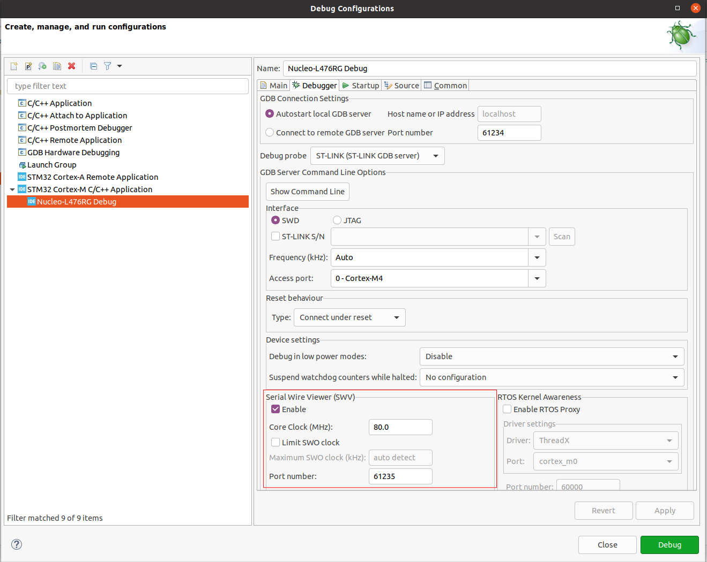

## Building, flashing, and debugging

### Build
[Here](https://github.com/lpn-plant/ms-tpm-20-ref) you can find our fork of
[Official TPM 2.0 Reference Implementation (by Microsoft)](https://github.com/microsoft/ms-tpm-20-ref).

The project is developed using
[STM32CubeIDE](https://www.st.com/en/development-tools/stm32cubeide.html)
so the building process is straightforward.

Just clone it with git...
```shell
git clone --recurse-submodules git@github.com:lpn-plant/ms-tpm-20-ref.git
cd ms-tpm-20-ref
git checkout samples_stm32cubeide
```

... and import it using `Import -> Existing Project into Workspace` in
`IDE Project Explorer`.

Select `Nucleo-L476RG` project from `ms-tpm-20-ref/Samples/Nucleo-TPM/L476RG`
directory.

### Flash and Debug
To flash/debug the application click on the green bug icon on the top toolbar
and select `Nucleo-L476RG Debug`.


If you cannot see it, select `Debug Configuration...` and it should be listed
under `STM32 Cortex-M C/C++ Application` menu selection.


Some extra tweaks were necessary to enable SWV ITM traces, other than that we are
using the default STLink debug configuration.



IDE debug configuration file is included in project root dir and should be
automatically available `Nucleo-L476RG Debug.launch`.
