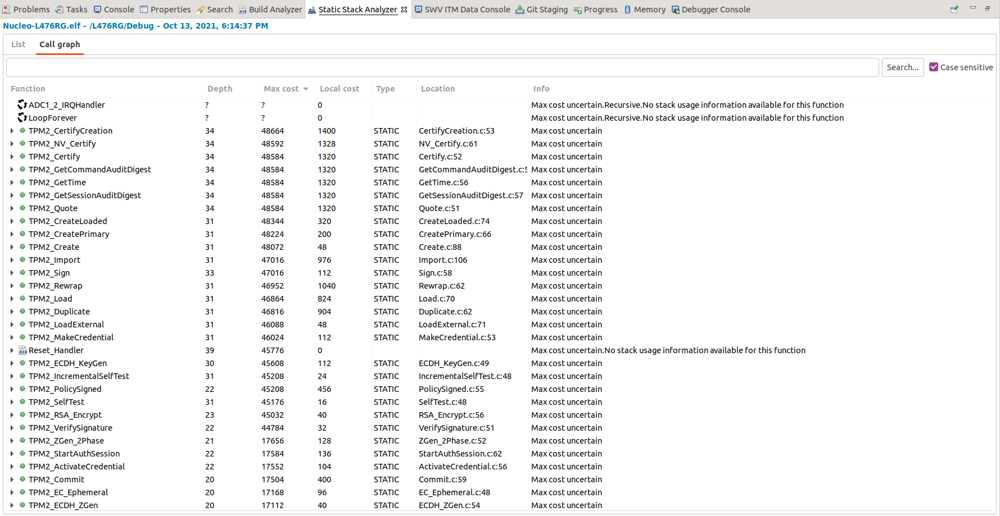

## Current issues

### Memmory usage
Memory limitations hit us right at the beginning preventing us from building the project for STM32L476RG on both Linux STM32CubeIDE and Windows Atollic Studio.

After limiting the minimal stack size in the linker script the application fits in SRAM memory, but probably the problem will hit us soon after successful execution of TPM command.

^^^^^^^^^^^^^^^^^^^^^ TODO open by click

At the moment of writing, we are almost out of memory.

### Outdated repository
After struggling a lot with build errors while compiling the `master` branch we decided to roll back repo to the actual commit adding STM32 samples. Future plans involve updating the repo, eventually hitting most actual changes.

### Differences between STM32 and Simulator implementation of command parsing
Dealing with the actual communication with TPM core we are facing some minor problems.

VCOM application dedicated to TPM communication, located in `ms-tpm-20-ref/Samples/Nucleo-TPM/VCOM` is created using Windows, so we have to decide if we want to port it.

Data packet for controlling the TPM differs between one used by `tpm2_tools`, Simulator, and STM32 implementation.

This point needs additional investigation, but a quick glance at received data sent by using `tpm2_startup -T device -d/dev/ttyACM1 --state` command ensures us about it. By /dev/ACM1 port we mean STM32 USB CDC.

### Possible bug in build system

According to the project assumptions, whole configuration is done using `user_settings.h` file. Previously encountered [error](https://github.com/lpn-plant/ms-tpm-20-ref/commit/c681b2130df35b0d1ae498656476f30cd4e472e4) led us to the conclusion that some parts of the aplication could be misconfigured.

Some of the build switches inside `TpmBuildSwitches.h` could be enabled in an unwanted way.

It needs to be further investigated with defines like `SIMULATION` and `SELF_TESTS` in mind. Maybe we can get some extra free RAM space this way.

