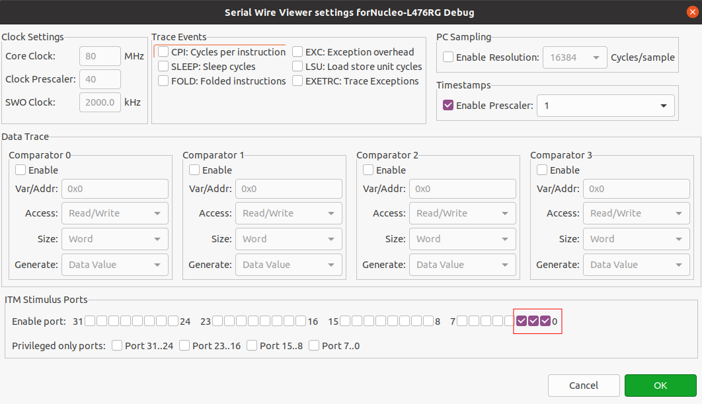

## Running

The project is using three communication interfaces to debug and talk to TPM core.

- TPM core communication is handled by STM32 USB CDC interface.
See
`https://github.com/microsoft/ms-tpm-20-ref/blob/master/Samples/Nucleo-TPM/USB_Hookup.jpg`
- `printf` is forwarded to the integrated STLink VCOM.
- `fprintf(stderr, *)` could be received on port 0 of ITM SWV.
- `dbgPrint` uses port 1 of  ITM SWV.

### ITM trace configuration
For now, ITM trace output is available only through STM32CubeIDE. We are
planning to add this feature using command-line tools like `openocd` or
`STM32_Programmer_CLI`.

To view ITM output first you should enable SWV ITM console, by selecting it in
`Window -> Show View -> Other`.

Next thing is to start to debug the application and when it hits the first
breakpoint select `Configure trace` under SWV ITM console.


Select the first three channels and accept.



After that you should be ready to go, so just click `Start Trace` - red dot icon
and hit F8 to continue program execution.


Now you should see trace debug output like in the picture below.


### USB CDC configuration

On some platforms (Ubuntu in my case) '/dev/ttyACM*' ports automatically receive
AT commands just after plugging USB cable.

As we are using raw data format to communicate with TPM device and STM32 CDC
port mount as /dev/ACM* device this could be problematic.

To stop receiving AT commands just disable ModemManager service with the
following command:

```shell
systemctl stop ModemManager
sudo systemctl disable ModemManager
```

### Sample command execution

As being said, the communication to the TPM core is done using Nuceo's USB CDC
Port. In the original implementation VCOM - Windows application was created for
this purpose. We choose a different approach and provide several ways to talk to
a TPM. Host applications and scripts for experimenting with the protocol are
located in `ms-tpm-20-ref/Samples/Nucleo-TPM/scripts` directory.

```
scripts
|   lpntpn_cmd              - main python script for tpm communication
|                             see ./lpntpn_cmd --help for more info
|   README.md
|   simulator               - serial port simulator for future protocol
|                             and tpm2-tools/tpm2-tss anallisis
|
|   tpm2-pytss_example      - simple startup example using tpm2-pytss library
|
└───tpm2-tts_example        - simple startup example using tpm2-tss library
|
└───utils
```

For now only `lpntpn_cmd` is able to execute its full commands without any
errors. pytss and tss examples were created for future communication with tpm
device and right now are failing, probably due to not implemented `pool`
functionality in `tty` kernel driver. More on that on
[Current issues](issues.md) page.

At the moment of writing, only `startup` and `shutdown` commands were
implemented.
As the original implementation adds some redundant data to the protocol,
`--legacy | --no-legacy` arguments were added to `lpntpn_cmd` application, to
allow the user to send VCOM compatible legacy commands.

Reception of such legacy commands requires commenting out
`#define NEW_SIGNAL_HANDLING` macro in main.c file, as it is defined by default.

Otherwise simple call to `./lpntpn_cmd` should be enough to be able to
execute `startup` command on lpntpn.

Before running host-side applications, you should flash and start STM32
binary, with debug prints reception enabled with ITM ports 0,1,2 as mentioned
in [ITM trace configuration](#itm-trace-configuration)

Succesfull execution, should result in the following console output:

``` console
$ ./lpntpn_cmd
running in non legacy mode...
on /dev/ttyACM1 serial port...
executing startup command...
	 sending: b'\x80\x01\x00\x00\x00\x0c\x00\x00\x01D\x00\x00'
waiting for response...
	 received: bytearray(b'\x80\x01\x00\x00\x00\n\x00\x00\x01\x00')
```

And following output in SWV ITM Data window

```
ITM port 0:

=========================
= Nucleo-L476RG TPM 2.0 =
=========================
2000.01.02-10:10:40.441GMT: Generated tpmUnique
    875fcea802b97786efd69cb3c1f1371b
    70d465d97b8c52532c3ba603f2fa571b
    ef6c44634a2910b303ef92a5d05a59f8
    adbc978cca2f2f9874b4e5a2216c10ec
2000.01.02-10:10:40.573GMT: NVFile loaded (16kb, 2000.01.01-03:23:25GMT created, 84 writes, 2000.01.02-10:02:27GMT last)
2000.01.02-10:10:40.576GMT: _plat__SetNvAvail().
2000.01.02-10:10:40.576GMT: _plat__Signal_PowerOn().
2000.01.02-10:10:40.576GMT: _plat__Signal_Reset().
2000.01.02-10:10:40.711GMT: NVFile loaded (16kb, 2000.01.01-03:23:25GMT created, 84 writes, 2000.01.02-10:02:27GMT last)
2000.01.02-10:10:40.714GMT: CDC_SET_LINE_CODING: 9600-8N1
2000.01.02-10:10:51.507GMT: CDC_SET_CONTROL_LINE_STATE: RTS=1, DTR=1
2000.01.02-10:10:51.507GMT: CDC_SET_LINE_CODING: 115200-7N2
2000.01.02-10:10:51.723GMT: Executing command TPM_CC_Startup()
2000.01.02-10:10:52.306GMT: NVFile written (16kb, 2000.01.01-03:23:25GMT created, 85 writes, 2000.01.02-10:10:52GMT last)
2000.01.02-10:10:52.309GMT: Completion time 0'1" with ReturnCode {TPM_RC_SUCCESS}
2000.01.02-10:10:52.315GMT: CDC_SET_CONTROL_LINE_STATE: RTS=0, DTR=0

ITM port 1:

2000.01.02-10:10:51.723GMT: SignalCommand(12)
2000.01.02-10:10:52.309GMT: Response(10)

ITM port 2:

//2000.01.02-10:10:51.723GMT
unsigned char CmdBuf[12] = {
0x80, 0x01, 0x00, 0x00, 0x00, 0x0c, 0x00, 0x00, 0x01, 0x44, 0x00, 0x00
};
//2000.01.02-10:10:52.309GMT
unsigned char RspBuf[10] = {
0x80, 0x01, 0x00, 0x00, 0x00, 0x0a, 0x00, 0x00, 0x00, 0x00
};

```


An example, changing command type, serial port, and enabling legacy mode.

```console
./lpntpn_cmd --port /dev/ttyACM0 --command shutdown --legacy
running in legacy mode...
on /dev/ttyACM0 serial port...
executing shutdown command...
	 sending: b'Tpm2\x06\x00\x00\x00\x14\x00\x00\x00\x00\x00\x00\x00\x0c\x00\x00\x00\x80\x01\x00\x00\x00\x0c\x00\x00\x01E\x00\x00'
waiting for response...
```

